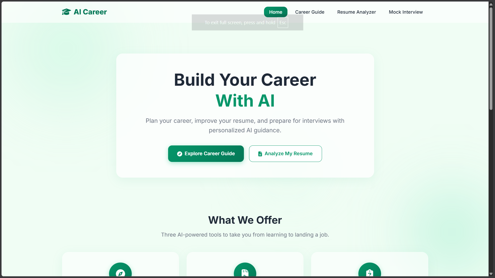
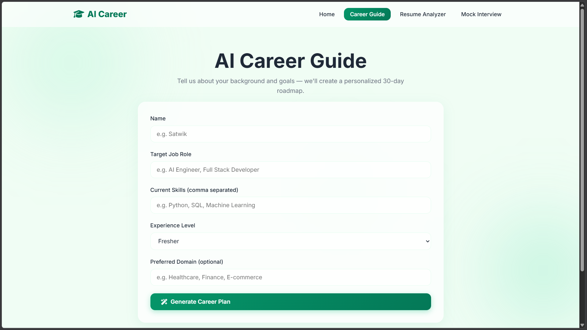
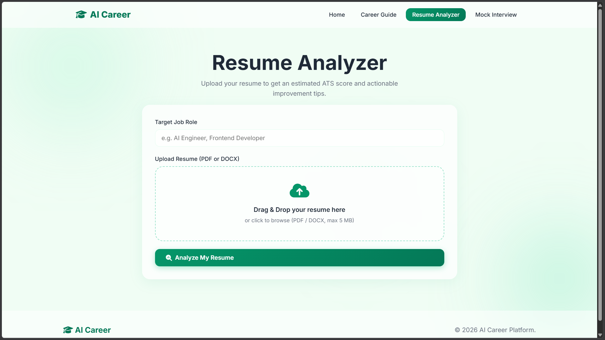
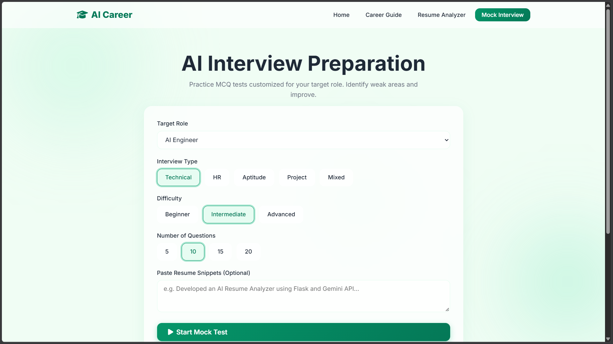

# AI Career Platform

## 1. Project Title
**AI Career Platform:** An Intelligent System for Career Guidance, Resume Analysis, and Interview Preparation.

## 2. Project Overview
The AI Career Platform is a comprehensive, AI-driven web application designed to help students and professionals navigate their career paths. By leveraging the power of Google's Gemini Large Language Model (LLM), this platform provides personalized 30-day learning roadmaps, intelligent resume analysis with ATS compatibility scoring, and interactive role-specific mock interviews. 

## 3. Problem Statement
In today's competitive job market, students and job seekers often struggle with unstructured learning paths, poorly optimized resumes that fail Applicant Tracking Systems (ATS), and a lack of realistic interview practice. There is a need for a unified, intelligent platform that guides a user from skill acquisition to final interview preparation.

## 4. Objectives
* Provide customized, structured learning roadmaps based on a user's current skills and target role.
* Analyze resumes against industry standards to identify skill gaps and calculate an estimated ATS compatibility score.
* Offer a highly interactive, dynamic Multiple Choice Question (MCQ) mock interview system to help users practice technical and HR concepts.
* Ensure a smooth, modern, and highly responsive user experience using Glassmorphism design principles.

## 5. Features
* **Personalized AI Career Plans:** Generates a 30-day day-by-day learning schedule.
* **Deterministic ATS Scoring:** Evaluates resumes using a Python-based keyword matching algorithm.
* **Qualitative AI Resume Feedback:** Uses Gemini AI to highlight strengths and areas for improvement.
* **Smart Resource Recommendation:** Suggests verified job portals and certifications.
* **Dynamic Mock Interviews:** Generates role-specific MCQ tests with varying difficulty levels.
* **Performance Analytics:** Tracks topic-wise performance and maintains a history of past interviews.

## 6. Modules
The application is divided into three primary modules connected by a seamless user workflow:
1. **AI Career Guide:** The starting point for skill planning.
2. **AI Resume Analyzer:** The evaluation engine for application readiness.
3. **AI Mock Interview:** The practice environment for final preparation.

## 7. Technology Stack
* **Frontend:** HTML5, CSS3 (Custom Glassmorphism Design), Vanilla JavaScript (ES6+).
* **Backend:** Python 3, Flask (REST API Architecture).
* **Artificial Intelligence:** Google Gemini API (`gemini-3.7-flash`).
* **Document Processing:** `pypdf` (for PDF extraction), `python-docx` (for DOCX extraction).
* **Storage:** Local JSON File System (No heavy databases required).

## 8. System Architecture
The platform follows a Client-Server architecture. The frontend sends JSON payloads and form data (including files) to the Flask backend via RESTful endpoints. The backend validates the data, applies deterministic logic (like parsing files or calculating ATS scores), and communicates with the external Gemini API for qualitative, generative tasks. The results are parsed, sanitized, and sent back to the client for dynamic DOM rendering.

## 9. Project Structure
```text
ai-career-platform/
│
├── app.py                      # Main Flask application and API routing
├── requirements.txt            # Python dependencies
├── .env                        # Environment variables (API Keys)
│
├── data/                       # Local JSON storage
│   ├── career_roles.json       # Deterministic requirements for ATS
│   ├── certifications.json     # Verified certification links
│   ├── job_portals.json        # Verified job portal links
│   └── interview_history.json  # Saved user mock test results
│
├── services/                   # Core business logic
│   ├── ats_service.py          # Deterministic ATS scoring algorithm
│   ├── career_service.py       # Career roadmap generation
│   ├── gemini_service.py       # Gemini API communication and error handling
│   ├── interview_service.py    # MCQ generation and history tracking
│   └── resume_service.py       # Resume processing pipeline
│
├── utils/
│   └── resume_parser.py        # PDF and DOCX text extraction
│
├── static/                     # Frontend assets
│   ├── css/style.css           # Glassmorphism design system
│   └── js/                     # Client-side logic (main.js, career.js, etc.)
│
└── templates/                  # HTML views (index.html, career.html, etc.)
```

## 10. Career Guide Workflow
1. User inputs their Name, Target Role, Current Skills, and Experience Level.
2. The frontend sends the data to `/api/career-plan`.
3. The backend constructs a strict prompt requesting a JSON response.
4. Gemini AI generates a 30-day roadmap, skill gaps, and project ideas.
5. The frontend renders the JSON into an interactive, expandable timeline.
6. The user's Target Role is saved to `sessionStorage` for seamless transition to the next module.

## 11. Resume Analyzer Workflow
1. User uploads a `.pdf` or `.docx` file and specifies their Target Role.
2. The file is validated for type and size (Max 5MB).
3. `pypdf` or `python-docx` extracts the raw text from the document.
4. The text is passed to Gemini AI to extract structured data (education, skills, projects) and generate qualitative feedback.
5. The structured data is passed to the deterministic ATS engine.
6. The frontend renders the ATS score circle, skill gaps, and AI feedback.

## 12. ATS Scoring Methodology
Unlike the qualitative feedback, the ATS score is **deterministic** to prevent AI hallucinations. 
1. The system loads `data/career_roles.json` which contains strict `required_skills` and `preferred_skills` for various tech roles.
2. It compares the skills found in the resume against these predefined lists.
3. The score (out of 100) is calculated based on:
   - Match percentage of required skills.
   - Match percentage of preferred skills.
   - Presence of standard resume sections (e.g., Education, Experience).
4. The system identifies exactly which skills are missing and recommends them to the user.

## 13. Mock Interview Workflow
1. User selects a Target Role, Interview Type (Technical, HR, etc.), Difficulty, and Question Count.
2. The backend prompts Gemini AI to generate a strict JSON array of MCQs based on those parameters.
3. The user takes the test in a dynamic, interactive UI.
4. Upon submission, the frontend evaluates the answers, calculates the score, and identifies weak topics based on incorrect answers.
5. The result is saved to `data/interview_history.json`.
6. The user can immediately choose to generate a new test focusing solely on their weak topics.

## 14. Gemini API Integration
The system uses the `google-generativeai` SDK to communicate with the `gemini-3.7-flash` model. 
* All prompts strictly enforce JSON-only outputs.
* Markdown formatting (e.g., ```json) is aggressively cleaned by the backend before parsing.
* A centralized `gemini_service.py` manages the initialization and exception handling for all AI requests.

## 15. Error Handling
The application features a robust, multi-layered error handling system:
* **API Failures:** Automatically catches quota limits, authentication errors, and network timeouts, returning safe, user-friendly messages rather than stack traces.
* **Invalid AI Responses:** Catches `JSONDecodeError` if the AI hallucinates or breaks formatting.
* **File Processing:** Safely catches corrupted PDFs or DOCX files without crashing the server.
* **Form Validation:** Both frontend and backend validate empty payloads to prevent `NoneType` exceptions.

## 16. Security
* **Secret Management:** The `GEMINI_API_KEY` is strictly confined to `.env` and is never exposed to the frontend. `.env` is ignored via `.gitignore`.
* **File Sanitization:** Uploaded resumes use `secure_filename()` to prevent path traversal attacks.
* **Temporary Storage:** Uploaded files are immediately deleted in a `finally` block after processing.
* **XSS Prevention:** All dynamic data rendered into the DOM by the frontend is sanitized using a custom `escapeHTML()` utility.
* **Information Disclosure:** Raw Python exceptions are logged to the backend console but never sent in HTTP responses.

## 17. Installation

**Prerequisites:** Python 3.8+ installed on your system.

1. Clone the repository and navigate to the project folder:
```bash
cd ai-career-platform
```

2. Create a virtual environment:
```bash
python -m venv venv
```

3. Activate the virtual environment (Windows):
```bash
.\venv\Scripts\activate
```

4. Install the required dependencies:
```bash
pip install -r requirements.txt
```

## 18. Environment Variables
Create a file named `.env` in the root directory (where `app.py` is located) and add your Google Gemini API key:

```env
GEMINI_API_KEY=your_actual_api_key_here
```
*(Do not share this key or commit it to GitHub. See `.env.example` for reference).*

## 19. Running the Application
Ensure your virtual environment is activated, then run the Flask server:

```bash
python app.py
```
The application will start on `http://127.0.0.1:5000`. Open this URL in your web browser.

## 20. Screenshots

* **Home Page:** Showcasing the Glassmorphism hero section.


* **Career Guide:** The generated 30-day timeline.


* **Resume Analyzer:** The ATS score circle and extracted skills.


* **Mock Interview:** The interactive MCQ interface and result dashboard.


## 21. Future Enhancements
* **Database Integration:** Migrate from local JSON storage to a robust relational database (e.g., PostgreSQL) for multi-user authentication and persistent cloud storage.
* **Coding Assessments:** Extend the Mock Interview module to include an embedded code editor for practical programming questions.
* **Web Scraping:** Dynamically scrape live job boards instead of using static JSON files for job portal recommendations.
* **Export Options:** Allow users to download their 30-day roadmap and interview reports as PDF files.
